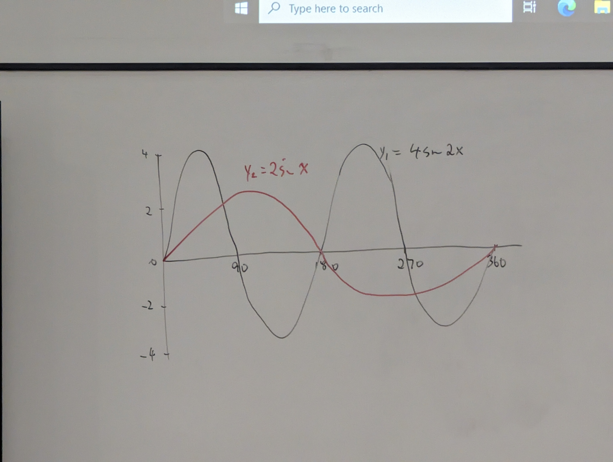

# revision

## graphing (2022 exam paper)

## Question 2

### Part (a)

#### (i) g(x) = x + 3 / 5

g (-8) = -8 + 5 / 5 = -5 / 5 = -1

#### (ii) g(x) = 2x - 1

g (3) = 2(3) - 1 = 6 - 1 = 5

#### (iii) f-1(7)

f(x) = 3x + -5

Find f-1(x)

y -> 3x - 5
y + 5 <- 3x
(y + 5) / 3 <- x

f-1 (x) = (x + 5) / 3

f(3) = 3(3) - 5 = 4

f-1(4) = 3

f-1(7) = (7 + 5) = 4

#### (iii) g (x)

3X + 5 = x+3 / 5

5(3x-5) = x + 3

15x - 25 = x + 3

15x - 1x = 3 = 25 

14x = 28

x = 2

### Part (b)

#### (i)

y1 = 4sin2x and y2 = 2sin x

amplitude of y1 = 4

amplitude of y2 = 2

period of y1 = 360 / 2 = 180

period of y2 = 360 / 1 = 360

#### (ii)

{:height="2px" width="2px"}

x = 520 - 180 = 340 - 180 = 160 degrees

when x = 520 degrees -> when 2x = -2.5

| x | -3 | -2 | -1 | 0 | 1 | 2 | 3 |
|----------|----------|----------|----------|----------|----------|----------|----------|
| y | 13.4 |  8.15 |  4.9  |  3  |  1.8 |  1.1  |   0.67 |

## Question 2

y1 = 4sin2x and y2 = 2sin x

amplitude of y1 = 4

amplitude of y2 = 2

period of y1 = 360 / 2 = 180

period of y2 = 360 / 1 = 360

#### (ii)

x = 520 - 180 = 340 - 180 = 160 degrees

when x = 520 degrees -> when 2x = -2.5

| x | -3 | -2 | -1 | 0 | 1 | 2 | 3 |
|----------|----------|----------|----------|----------|----------|----------|----------|
| y | 13.4 |  8.15 |  4.9  |  3  |  1.8 |  1.1  |   0.67 |