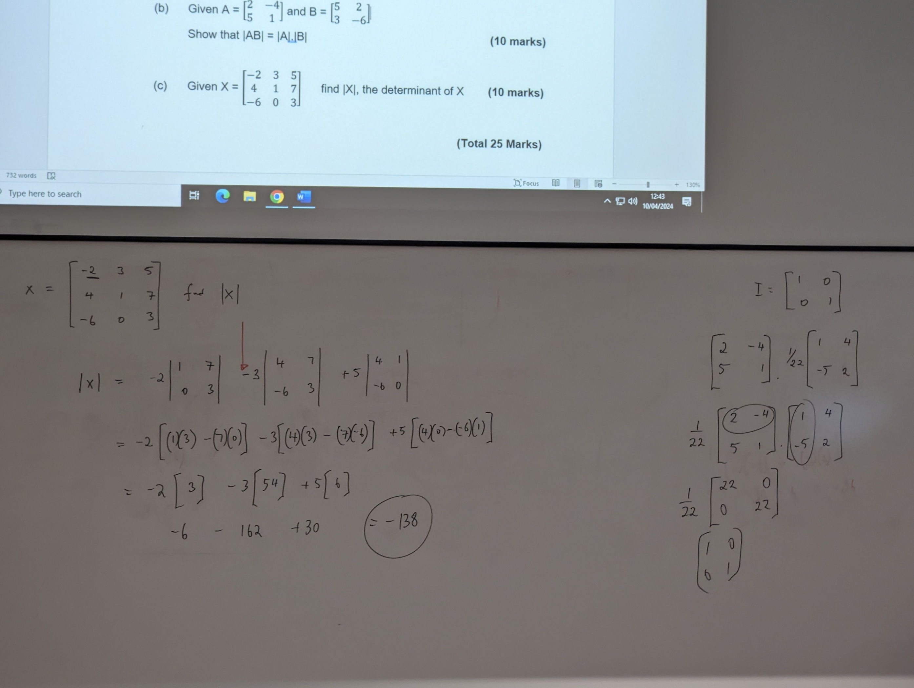

# Matrisays revision

## question 1 ( Find CD )

| a = |    |
| --- | -- |
| 5   | -6 |
| 3   | -2 |
| 7   | 4  |

| b = |    |   |
| --- | -- | - |
| 9   | 2  | 3 |
| 4   | -7 | 1 |

| c = |    |
| --- | -- |
| 4   | 5  |
| 8   | -2 |

| d = |   |    |
| --- | - | -- |
| 5   | 7 | -1 |
| 3   | 6 | 2  |

FInd CD

| CD = |    |
| ---- | -- |
| 4    | 5  |
| 8    | -2 |

5 7 -1
3 6 2

| CD =         |              |
| ------------ | ------------ |
| 4*5 + 5*3  | 4*7 + 5*6  |
| 8*5 + -2*3 | 8*7 + -2*6 |

| CD =    |          |
| ------- | -------- |
| 20 + 15 | 28 + 30  |
| 40 + -6 | 56 + -12 |

| CD = |    |
| ---- | -- |
| 35   | 58 |
| 34   | 44 |

    x11 = (4*5) + (5*3) =

 20 + 15 = 35
    x12 = (4*7) + (5*6) = 28 + 30 = 58

## question 2 ()

