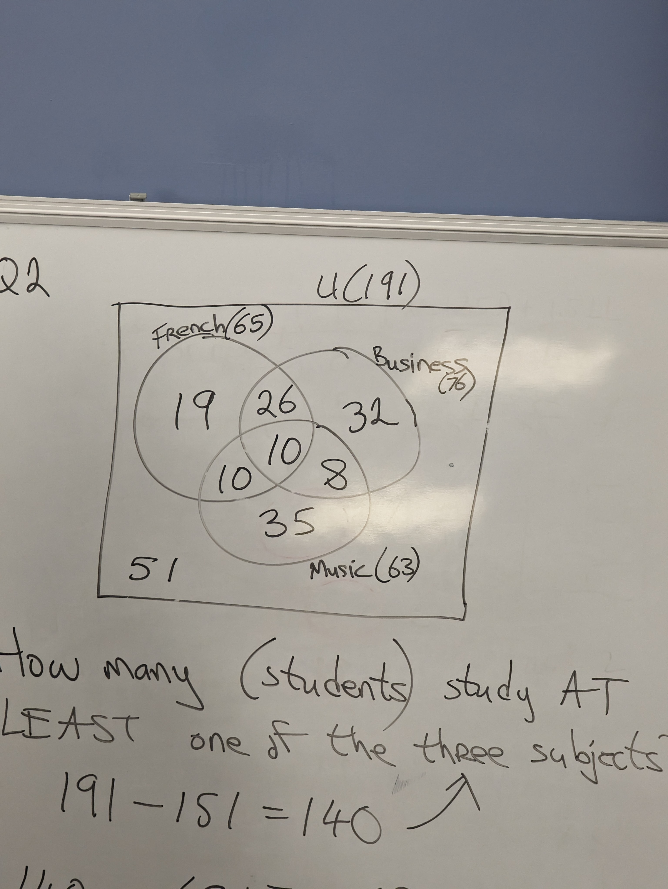
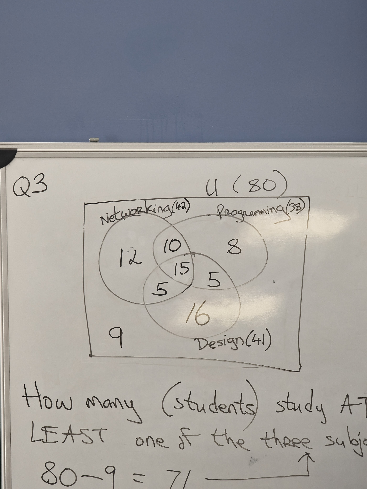

# Tutorial 8: set theory

Q1:

a) Incorrect, as 5 not B but of A

b) B n A = {3,4}
    c' = {1,2,3,4,5}
     Correct

c) A U B = {1,2,3,4,6,7,8}
   incorrect as 5 is not but A U B

d) A - B = {3.4}
    (A n B)'= {1,2,5,6,7,8}
     Correct

Q2:

How many (students) study at least one of the three subjects?

191 - 151 = 140

140 = 65 + 76 + 63 - 36 - 20 - 18  + X

140 = 130 + X

so X  = 10

19 + 32 + 35 = 86 study one subject only

10 students study french and music but not business

32 + 26 = 58 study music but not business

Q3:

How many (students) study at least one of the three subjects?

80 - 9 = 71

71 = 42 + 38 + 41 - 25 - 20 - 20 + X

71 = 56 + X so X = 71 - 56 = 15

 36 students studied all three

 18 students programming but not design

 15 studies exactly one of the three

 
